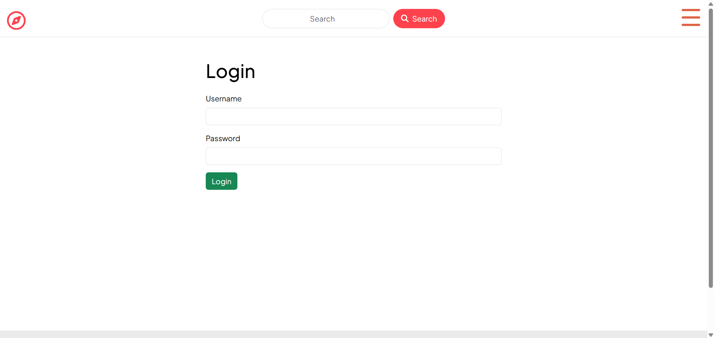
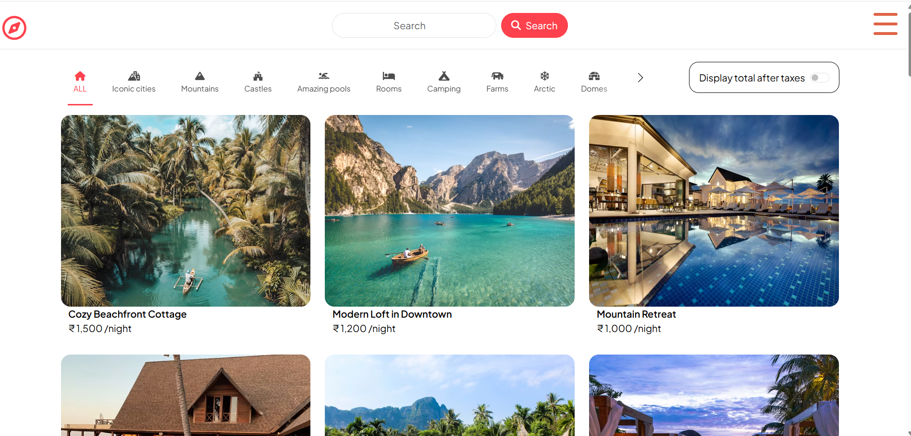
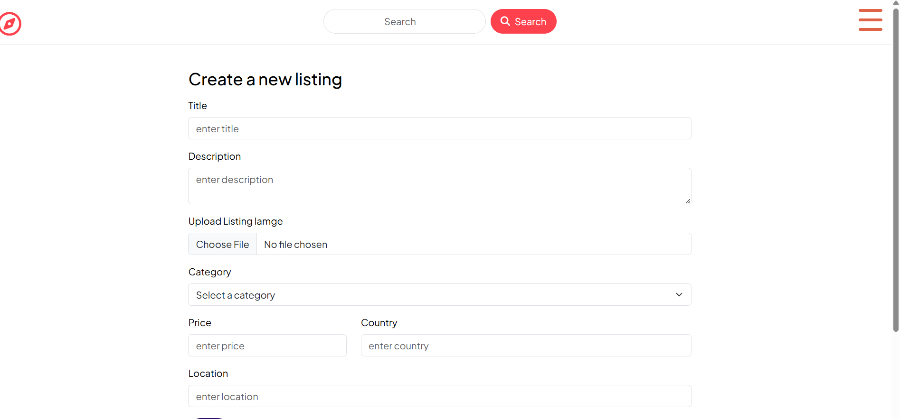
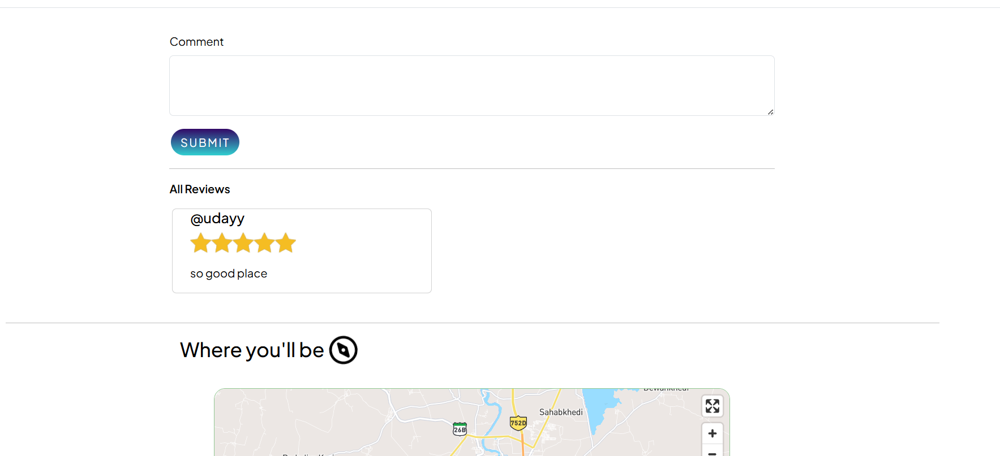
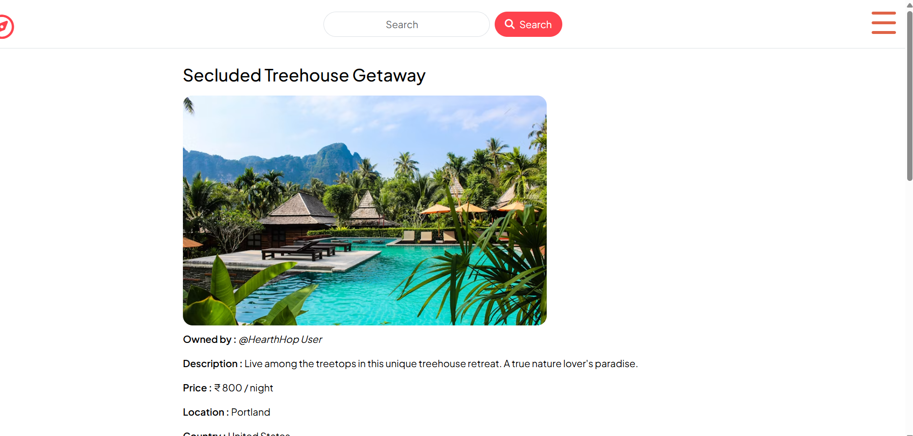

# HearthHop 🏡

HearthHop is a full-stack accommodation rental platform inspired by Airbnb that enables users to discover, create, and manage property listings. The platform provides a seamless booking-style experience with secure authentication, image uploads, reviews, interactive maps, and responsive design.

## Live Demo

🔗 Live Project: https://hearthhop.onrender.com/listings

## Project Overview

HearthHop was built to simulate a real-world rental marketplace where users can:

* Explore accommodation listings
* Create and manage their own properties
* Upload property images
* Leave reviews and ratings
* Search and filter listings
* View property locations on interactive maps

The project follows the MVC architecture and demonstrates full-stack development concepts including authentication, authorization, database management, cloud storage integration, and RESTful APIs.

## Features

### Property Listings

* Create new listings
* Edit existing listings
* Delete listings
* View detailed property information

### User Authentication

* User registration
* Secure login and logout
* Session management using Passport.js
* Authorization and protected routes

### Reviews & Ratings

* Add reviews to listings
* Delete reviews
* Rating system for properties

### Media Management

* Property image uploads
* Cloudinary image storage
* Optimized media delivery

### Search & Discovery

* Browse all listings
* Search functionality
* Filter listings by category

### Maps Integration

* Interactive property location maps
* Location visualization using Mapbox

## Tech Stack

### Frontend

* EJS
* HTML5
* CSS3
* Bootstrap
* JavaScript

### Backend

* Node.js
* Express.js

### Database

* MongoDB
* Mongoose

### Authentication

* Passport.js
* Express Session

### Cloud Services

* Cloudinary
* Mapbox

### Other Tools

* Multer
* Connect Flash
* Joi Validation

## Screenshots

### Home Page

### Listing Details

### Create Listing

### Reviews Section

### User Authentication

## Application Flow

1. User signs up or logs in.
2. User creates a property listing.
3. Images are uploaded and stored using Cloudinary.
4. Listings are saved in MongoDB.
5. Visitors can browse listings and view property details.
6. Authenticated users can submit reviews and ratings.
7. Property locations are displayed using Mapbox.

## Installation

### Clone Repository

git clone https://github.com/udayykhatri/HearthHop

### Install Dependencies

npm install

### Configure Environment Variables

Create a .env file and add:

* MongoDB Connection String
* Cloudinary Credentials
* Mapbox Token
* Session Secret

### Start Application

npm start

Visit:

http://localhost:8080

## Future Improvements

* Booking System
* Wishlist Functionality
* Property Availability Calendar
* Payment Gateway Integration
* Advanced Search Filters
* Email Notifications

## Author

Uday Khatri

## License

This project is intended for educational and portfolio purposes.
